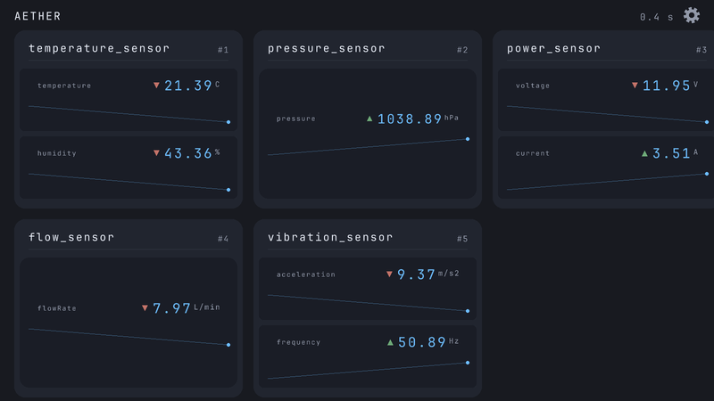
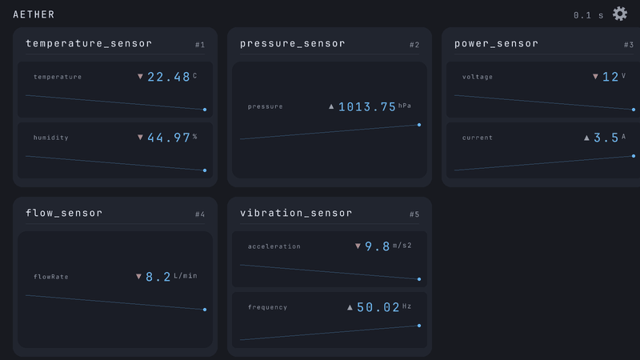

# Aether
<p align="center">
  
</p>

[](https://github.com/SalzDevs/Aether/actions/workflows/ci.yml)

Aether is a small C application that simulates sensor readings and displays them in a real-time Raylib dashboard.

<p align="center">
  
</p>

## Features

- Load any number of sensors from a YAML config, each with an arbitrary
  list of named metrics carrying units (`temperature (C)`, `pressure (hPa)`, ...)
- Adaptive card grid: each metric renders as a chip with its value,
  sparkline, and up/down change indicator
- Card detail view with large trend lines and min/avg/max stats per metric
- Tabbed navigation: a tab holds as many cards as fit the window;
  overflow goes to numbered tabs (`1 2 ... N`), clickable and bound to
  `Alt/Cmd + 1..9`
- Settings modal to toggle trend lines, value animation, and change
  indicators at runtime
- Fixed-slot task scheduler decoupled from data handling
- Bounded per-sensor reading history (ring buffers)
- Unit tests for configuration, history, scheduler, sensor, and
  dashboard layout modules

## Demo

<p align="center">
  
</p>

## Requirements

- C compiler with C99 support
- `make`
- `pkg-config`
- Raylib

### macOS

```sh
brew install raylib libyaml pkg-config
```

### Linux

Install your distribution's development packages for:

- GCC or Clang
- Make
- `pkg-config`
- Raylib

For example, package names may include `build-essential`, `pkg-config`, `libraylib-dev`, and `libyaml-dev`.

## Build and run

Build the application:

```sh
make
```

Run it:

```sh
./main
```

Clean generated files:

```sh
make clean
```

## Run tests

Build and run all unit tests:

```sh
make test
```

The test suite covers:

- sensor initialization and simulated updates;
- reading history ordering, oldest-entry eviction, and metric statistics;
- task scheduling;
- YAML configuration loading, including malformed input, unknown keys,
  missing ids, and growing registries;
- dashboard layout math: tab capacity, pagination limits, and range mapping.

## Configuration

Sensor data is loaded from:

```text
config/sensors.yaml
```

Example:

```yaml
sensors:
  - id: 1
    name: temperature_sensor
    metrics:
      - name: temperature
        unit: C
        value: 22.5
      - name: humidity
        unit: "%"
        value: 45
```

Each sensor requires:

| Field | Description |
| --- | --- |
| `id` | Unique numeric sensor identifier |
| `name` | Readable sensor name |
| `metrics` | List of metrics, each with `name`, `unit` and `value` |

Note: a `%` unit must be quoted (`"%"`) because libyaml reserves the percent sign.


## Controls

| Input | Action |
| --- | --- |
| Click the cogwheel (top right) | Open/close the settings modal |
| Click a card | Open that sensor's detail view |
| Click a numbered tab (bottom) | Jump to that tab |
| `Alt/Cmd` + `1..9` | Jump directly to tab N |
| `←` / `→` | Previous / next tab |
| `Esc` | Close the detail view or settings modal |

## Project structure

```text
.
├── assets/fonts/ Bundled font (JetBrains Mono, SIL OFL)
├── config/       Sensor configuration loading and YAML data
├── docs/         Screenshots and demo media
├── history/      Bounded per-sensor reading history (ring buffer)
├── scheduler/    Periodic task scheduling
├── sensor/       Sensor data types and simulation
├── ui/           Dashboard rendering, layout math, theme tokens (Raylib)
├── tests/        Unit tests
├── main.c        Application entry point
└── Makefile      Build and test commands
```

## Architecture

```text
sensors.yaml
     │
     ▼
configuration parser
     │
     ▼
sensor registry ◄── scheduled sensor tasks (update in place)
     │                    │
     ▼                    ▼
Raylib dashboard     per-sensor reading history (ring buffers)
```

## License

This project is licensed under the [MIT License](LICENSE).
